## Gene Expression Explorer

### Introducción 

Nuestro proyecto consiste en un app de Shiny que sirve para explorar y analizar estudios científicos enfocados en el análisis de expresión de genes mediante microarreglos.

Los procesos biológicos de todos los seres vivos se dan mediante la acción de proteínas - estructuras biológicas que realizan todas las funciones de los organismos y construyen su estructura física. A su vez, estas moléculas se construyen a partir de la información codificada en el genoma, que se divide en estructuras discretas llamadas genes. Así, un gen específico, como por ejemplo el gen _LCT_, ubicado en el cromosoma 2 del genoma humano, se encarga de codificar la proteína de la lactasa, que permite a los seres humanos digerir la leche materna y de otras especies de mamíferos. Se dice que este gen se expresa cuando se encuentra activo y, mediante una serie de procesos, un grupo de células produce lactasa utilizando como modelo la secuencia del gen.

No todos los genes producen proteínas; muchísimos genes funcionan como reguladores, bloqueando la expresión de otros genes o regulando su funcionamiento de otras formas. Un ejemplo de esto, retomando el ejemplo de la lactasa, es el gen de regulación _MCM6_; este gen regula la expresión del gen _LCT_ y causa que después de la infancia no se exprese más. En muchas poblaciones de origen europeo una mutación en la secuencia de _MCM6_ impide que pueda expresarse, y al no regular la expresión del gen _LCT_, las personas producen lactasa y pueden consumir y digerir leche toda su vida.

Considerando esto, medir y analizar la expresión de los genes en un organismo es fundamental para conocer sus procesos biológicos y entender cómo reacciona ante estímulos externos. Son comunes los estudios científicos donde se analiza la expresión de los genes en diferentes muestras, usualmente divididas en grupos con tratamientos distintos; por ejemplo, analizando pacientes con y sin un tratamiento específico y viendo las respuestas del cuerpo ante el tratamiento a nivel celular.

¿Cómo medir, entonces, la expresión de genes específicos? De manera general esto se realiza con una tecnología conocida como microarreglos o _microarrays_, los cuales son un soporte físico de vidrio o algún polímero plástico que contiene una red o grid de cientos de pequeños puntos. Cada punto contiene secuencias de ADN diseñadas de forma complementaria a genes específicos. Un microarray puede tener secuencias para más de 50,000 genes, permitiendo el estudio sistemático y exhaustivo de la expresión génica. El procedimiento general es el siguiente:

1. Se extrae el ADN de una muestra (o varias, en el caso de tener replicas).
2. Este ADN es modificado para que incorporen a su estructura moléculas fluorescentes con un color específico.
3. El ADN de otra muestra con características diferentes es extraído y se le incorporan moléculas fluorescentes con otro color.
4. Ambas muestras se incuban por un tiempo determinado con el microarray.
5. Se mide la fluorescencia en cada uno de los puntos del microarray.

Dado que los genes más expresados tienen más copias en las células donde se expresan, una muestra con un gen activo tendrá una fluorescencia más intensa en el punto del grid del _microarray_ asignado para ese gen. Tras la incubación, el _microarray_ es escaneado por un sistema lector específico que detecta y cuantifica la fluorescencia, tomando en cuenta el ruido visual y estandarizando la expresión para todos los puntos del arreglo.

Los resultados de este proceso nos permiten contestar preguntas como qué genes se expresan más en ciertas condiciones o tratamientos, con base en su expresión en las diferentes muestras. Ya con esta información, podemos generar nuevas hipótesis acerca de los mecanismos moleculares involucrados en lo que estemos estudiando (enfermedades, síndromes genéticos, tratamientos médicos, etcétera). El proceso general puede verse en la siguiente figura:

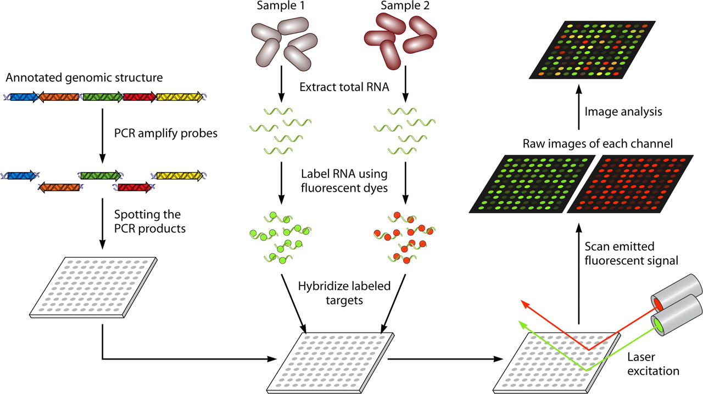

Además de un análisis estadístico de las diferencias entre las diferentes muestras, otro análisis rutinario es la creación de _gene networks_, redes cuyos nodos son los genes y los bordes son la relación entre los genes -es decir, si se expresan con intensidad similar en las mismas muestras-. Dado que los genes casi nunca trabajan de manera independiente, sino que están relacionados mediante interacciones de inhibición y estimulación, estos bordes indican relaciones de asociación o causalidad, que pueden confirmarse en experimentos subsecuentes. Dentro de este tipo de análisis es particularmente importante el concepto de módulos de coexpresión o _hubs_ de genes, que son grupos de genes fuertemente asociados y que usualmente representan respuestas celulares complejas ante un estímulo específico.

### Datos empleados

Para nuestro proyecto, tomamos información de la base de datos en línea [Gene Omnibus Datasets](https://www.ncbi.nlm.nih.gov/gds), que depende del National Center for Biotechnology Information de Estados Unidos. Esta base de datos incluye información con una estructura estandarizada para miles de estudios científicos publicados, lo que la hace idónea para nuestros fines.

Dentro de esta base de datos, podemos buscar estudios sobre el tema que nos interese y encontrar la información de expresión génica que obtuvieron. Los datos se encuentran en forma de matrices, como la que podemos ver a continuación:

| ID_REF   | GSM1342264 | GSM1342265 | GSM1342266 | GSM1342267 | GSM1342268 | GSM1342269 |
|----------|------------|------------|------------|------------|------------|------------|
| 10344614 | 85.4061    | 88.6601    | 118.42     | 107.704    | 110.664    | 91.1997    |
| 10344616 | 6.59375    | 7.25329    | 8.10524    | 7.24063    | 6.87043    | 7.41092    |
| 10344618 | 9.08561    | 9.52269    | 10.0718    | 10.0997    | 9.57139    | 9.31492    |
| 10344620 | 14.0927    | 13.9992    | 14.6304    | 18.8253    | 12.0054    | 14.9826    |
| 10344622 | 113.845    | 86.2392    | 131.014    | 96.0475    | 109.205    | 108.825    |
| 10344624 | 1481.27    | 1470.65    | 1578.71    | 1305.17    | 1340.74    | 1273.69    |
| 10344633 | 1016.69    | 1029.25    | 1022.79    | 1109.64    | 1126.42    | 1142.95    |
| 10344637 | 789.346    | 870.415    | 827.734    | 626.949    | 600.064    | 564.085    |
| 10344653 | 11.4139    | 11.928     | 12.8065    | 12.6583    | 13.4007    | 14.3683    |
| 10344658 | 292.438    | 236.623    | 229.184    | 139.796    | 204.543    | 206.081    |

En esta matriz, los renglones son los diferentes genes, identificados con un código único para cada modelo de microarray, y las columnas son muestras diferentes. Los valores identifican el nivel de expresión de cada muestra, ya normalizado.

### Cálculo de similitud entre genes

La manera más sencilla y directa de determinar los genes que se expresan de manera similar es simplemente calcular la distancia entre los vectores de cada gen, siendo la distancia euclidiana la métrica más común para medir esta distancia. En la mayoría de los estudios de expresión génica esta distancia se calcula entre cada uno de los genes, por lo que hay que realizar $n\times n$ comparaciones, donde _n_ es el número de genes en el modelo de microarray empleado. Este proceso puede tomar más de 60 horas en una computadora personal comercial, tiempo que, considerando que un estudio clínico puede tomar más de 2 años, es relativamente poco. Sin embargo, a la hora de explorar los datos de estudios ya realizados sería adecuado tener una manera de estimar una aproximación de esta distancia sin tener que realizar un proceso tan computacionalmente costoso.

Matemáticamente, los valores de expresión de los genes de un estudio particular tienen una distribución espacial en 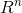, siendo _n_ el número de muestras en el microarreglo. El proceso de agrupamiento de los genes en el espacio no es intuitivo, ya que involucra dimensiones altas. Adicionalmente, el rango del número de muestras en los microarreglos es bastante variado; es tan común encontrar estudios que incluyan 3 muestras como estudios con mas de 40 muestras.  Existen métodos de agrupación por vecinos más cercanos eficientes para analizar puntos en espacios de altas dimensiones y uno de ellos es el método de local sensitive hashing (LSH) euclideano.

### LSH euclideano 

##### **Funciones Hash**

La intuición detrás del método de LSH euclideano está basada en la proyección de los puntos sobre líneas aleatorias generadas en el espacio; estas proyecciones, resultado del producto punto entre la línea y el vector de coordenadas, se dividen en cubetas de manera equitativa. Una función hash es realmente una línea aleatoria en el espacio y el valor hash que se genera a partir de cada punto *x* es el número de cubeta sobre la cual está proyectado.

Si tenemos dos vectores, 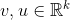 la distancia entre ellos es equivalente a: 

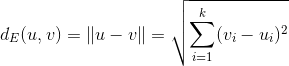

La función hash *h* se define como sigue:

-   Se toma un vector unitario aleatorio 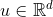 
-   Se proyecta 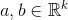 sobre *u*:

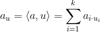

-   Se crean cubetas de tamaño  en *u* que ahora se encuentra en , este valor del índice de la cubeta es lo que regresará la función hash 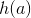.

    Si 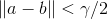 entonces la probabilidad 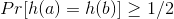. Por otra parte si 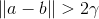 entonces la probabilidad 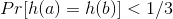. Esto se traduce en la familia sensible a la localidad 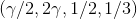.

##### **Demostración gráfica de funciones hash**

Para comprender mejor el método de LSH euclideano, se puede visualizar un espacio bidimensional en el cual se pueda representa geométricamente el funcionamiento del método. Gráficamente, el LSH euclideano funciona como lo expresa la siguiente figura, en la que las distancias hacia la línea aleatoria son agrupadas con colores. En este caso, ese grupo de distancias sería el valor que arrojaría la función hash . Por supuesto, hablar de un espacio bidimensional en el proyecto de genes es hablar de un microarreglo que contenga unicamente dos muestras (cada eje representa una muestra distinta).

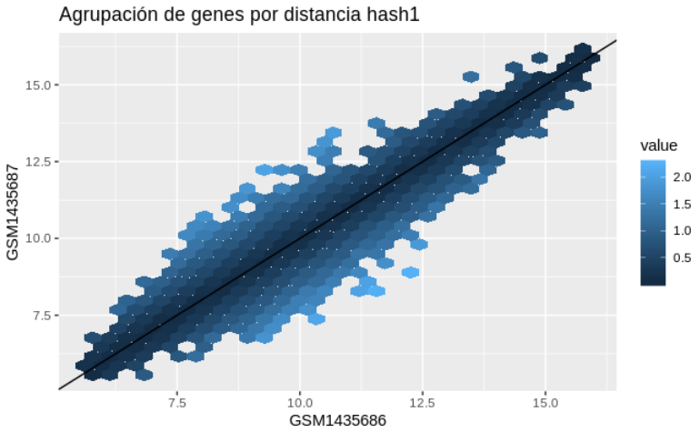

Si se generaran otros trazos de líneas aleatorias sobre el espacio de , las funciones hash regresarían nuevos valores que clasifican a los puntos dentro de distintas cubetas. La siguiente figura muestra un ejemplo de este proceso.

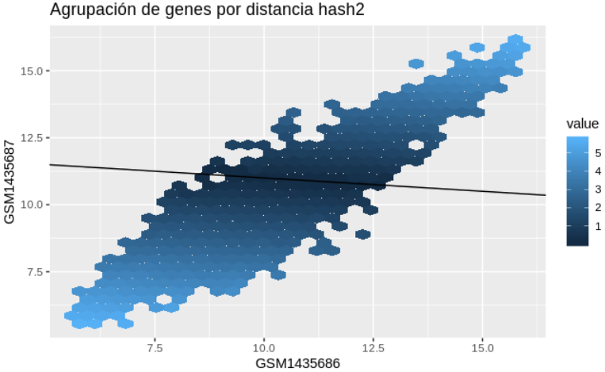

##### **Técnica de bandas**
 
La técnica de bandas sirve para encontrar documentos de similitud alta, con distintos umbrales de similitud. Si suponemos que tenemos un total de *k* hashes, divididos en *b* bandas de tamaño *r*, en donde *k*=*b* *r*. Un par de documentos coinciden en una banda cuando todos los hashes de la banda son iguales y un par de documentos es un par candidato cuando coinciden al menos en una banda.

En nuestro análisis de expresión génica se utilizaron 200 funciones hash (*k*=200), con 25 bandas (*b*=25) de tamaño 8 (*r*=8). Si la distancia es mayor a 5 la probabilidad de que los genes tengan el mismo hash es 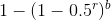, lo que en el caso de nuestro análisis sería una probabilidad de 9.3%. Si la distancia es menor a 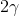 entonces la probabilidad que tenga el mismo hash es menor a 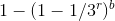, lo que en nuestro caso sería una probabilidad de 0.3%. En nuestra elección de parámetros preferimos evitar falsos positivos, garantizando que los genes dentro de las canastas tengan una gran probabilidad de ser cercanos.

Para nuestro modelo de LSH euclideano la configuración de la técnica de bandas se desempeña como se ilustra en la figura siguiente, en la cual es claro que se discrimina por candidatos que tengan similitud alta.

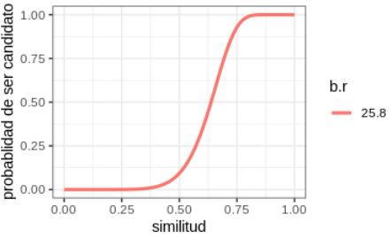

### App para análisis de expresión génica

Para este proyecto, desarrollamos una aplicación de Shiny en R v3.5.3 que nos permite buscar y explorar las bases de datos disponibles en línea en la plataforma de GEO. La aplicación está disponible en el repositorio de GitHub [https://github.com/facosta8/gene_expression_explorer](https://github.com/facosta8/gene_expression_explorer) y tiene los siguiente componentes:

* **Browser**. Permite buscar los estudio disponibles en la plataforma GEO y ver el resumen del estudio.
* **Genes**. Permite seleccionar un estudio y descargar los datos de expresión correspondientes a él. Tras la operación, puede verse el número de genes que se analizaron y el número de muestras.
* **Genes similares**. En esta sección se realiza el análisis de LSH con distancias euclidianas, con el fin de generar un cierto número de cubetas con genes cercanos entre sí. Una vez que el análisis concluye, el usuario puede seleccionar cualquier de las cubetas y el programa calcula la distancia real entre los genes, que se representa mediante un heatmap. Al hacer clic en cualquier celda del heatmap, es posible consultar las características de los genes que se comparan; esto incluye su nombre, secuencia, función, componentes celulares en los que se localiza y los procesos en que participa. Esto no está disponible para todos los estudios, ya que la información de a qué gen corresponde cada punto del microarreglo es algo que el fabricante pone en línea.
* **Red**. En esta sección puede verse la red de los genes de cualquiera de las cubetas detectadas. Es posible seleccionar a genes específicos (para ver cuáles son sus conexiones directas), así como modificar la distancia mínima para que se formen enlaces entre los diferentes nodos de la red.

Aunque esta herramienta no permite realizar un análisis a detalle de los resultados de un estudio en particular, su función no es ésta. El objetivo de nuestro proyecto es generar una herramienta intuitiva para explorar resultados publicados de estudios de expresión génica, para poder identificar ya sea estudios prometedores o _hubs_ de genes interesantes y así poder realizar subsecuentemente un análisis o estudio más profundo. 

### Bibliografía

González, Felipe (2019). _Locality sensitive hashing_. Metódos Analíticos. ITAM. Consultado en: https://admiring-feynman-7b07f8.netlify.com/similitud-locality-sensitive-hashing.html

Melissa B. Miller, Yi-Wei Tang, _Basic concepts of microarrays and potential applications in clinical microbiology_, Clinical Microbiology Reviews Oct 2009, 22 (4) 611-633; DOI: 10.1128/CMR.00019-09

National Human Genome Research Institute (2015). _DNA microarray technology fact sheet_. Consultado en: https://www.genome.gov/about-genomics/fact-sheets/DNA-Microarray-Technology

Phillips, Jeff (2013). _Locality sensitive hashing_, Data Mining Course. University of Utah. Consultado en: https://www.cs.utah.edu/~jeffp/teaching/cs5955/L6-LSH.pdf

